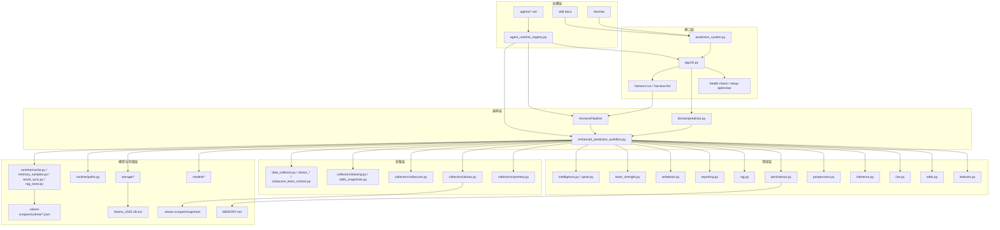
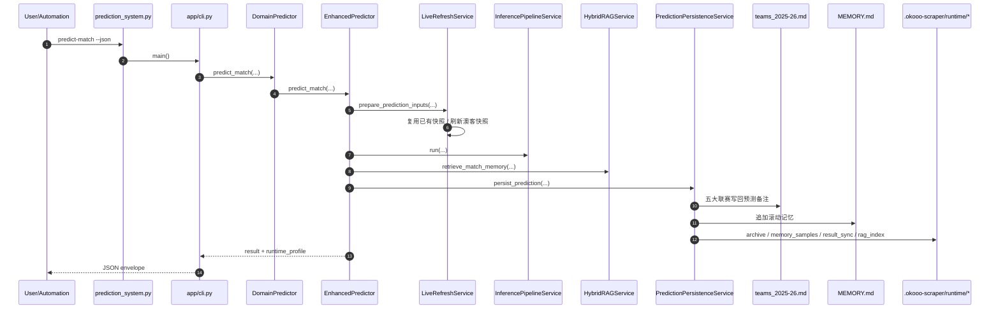
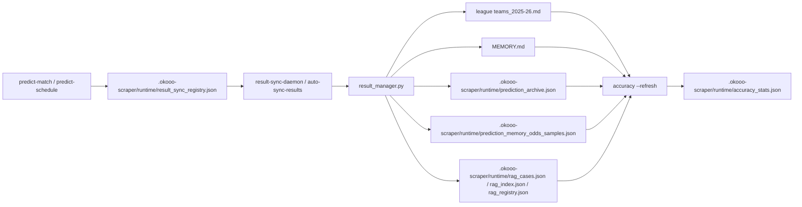
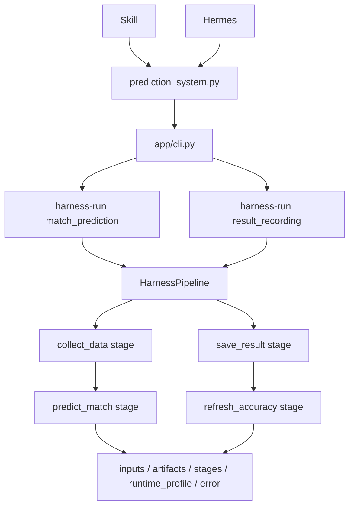

# Europe Leagues 项目架构与模块划分（技术分析）

本文目标：
- 用当前仓库中的真实代码结构解释分层、依赖与职责边界
- 更新文档中过时的路径描述，特别是 runtime 文件、CLI 命令集与环境依赖边界
- 区分正式主链、兼容壳、支撑脚本与历史存量实现

范围：
- 代码：`/Users/bytedance/trae_projects/europe_leagues`
- 治理与 persona：`/Users/bytedance/trae_projects/agents/*.md`、`/Users/bytedance/trae_projects/agent_runtime_registry.py`

---

## 1. 仓库总览

当前仓库已经形成稳定的“正式主链 + runtime 落盘 + 支撑脚本”结构，可按 6 层理解：
- **接口层**：`prediction_system.py`、`app/cli.py`、`harness/*`
- **编排层**：`domain/predictor.py`、`enhanced_prediction_workflow.py`
- **领域层**：`domain/*` 中的特征、赔率、临场、推理、后处理、持久化、RAG、报告与写回服务
- **采集层**：`collectors/*` 及仍保留的 `okooo_*`、`data_collector.py`、`sofascore_team_context.py`
- **模型与存储层**：`models/*`、`storage/*`、`runtime/*`、`.okooo-scraper/*`
- **治理层**：`agents/*.md`、`agent_runtime_registry.py`

这里的“仓库架构”有两个关键变化已经固定下来：
- 对外命令入口已经收敛到 `app/cli.py`，`prediction_system.py` 只保留兼容壳
- 运行时数据不再散落在根目录，而是统一通过 `runtime/paths.py` 指向 `.okooo-scraper/runtime/`、`.okooo-scraper/snapshots/`、`.okooo-scraper/schedules/`

对 Hermes 或其他接入方的固定识别规则：
- 可以从 `prediction_system.py` 发现项目入口
- 但必须继续下钻到 `app/cli.py` 识别并执行真实命令
- 不要把 `prediction_system.py` 当作业务主逻辑实现层

### 1.1 关键入口

- CLI 兼容入口：`europe_leagues/prediction_system.py`
- CLI 实际实现：`europe_leagues/app/cli.py`
- 领域外壳：`europe_leagues/domain/predictor.py`
- 预测编排核心：`europe_leagues/enhanced_prediction_workflow.py`
- Harness 编排：`europe_leagues/harness/core.py`、`europe_leagues/harness/football.py`
- runtime 路径统一入口：`europe_leagues/runtime/paths.py`
- persona/runtime registry：`agent_runtime_registry.py`

### 1.2 正式联赛范围

当前正式纳入 `LEAGUE_CONFIG`、可直接通过主链命令调用的 competition code 共有 8 个：
- 五大联赛：`premier_league`、`la_liga`、`serie_a`、`bundesliga`、`ligue_1`
- 欧战：`europa_league`、`champions_league`、`conference_league`

需要特别注意：
- 仓库里出现某个联赛目录，不等于它已经进入正式主链
- 例如 `afc_champions_league/` 当前更像数据目录或快照落盘目录，不属于现行 `LEAGUE_CONFIG`

### 1.3 单一事实来源与 runtime 边界

项目当前的“事实写回”采用双路径：
- **五大联赛 SoT**：`europe_leagues/<league>/teams_2025-26.md`
- **跨联赛滚动记忆**：项目根 `MEMORY.md`
- **运行时归档与索引**：`europe_leagues/.okooo-scraper/runtime/*.json`

其中 `.okooo-scraper/runtime/` 已经是当前实现里的统一 runtime 数据目录，实际可见文件包括：
- `prediction_archive.json`
- `prediction_memory_odds_samples.json`
- `result_sync_registry.json`
- `accuracy_stats.json`
- `rag_cases.json`
- `rag_index.json`
- `rag_registry.json`
- `sofascore_team_ids.json`

另外还有两类运行时目录：
- `europe_leagues/.okooo-scraper/snapshots/`：赔率快照、抓取结果、欧战别名目录快照
- `europe_leagues/.okooo-scraper/schedules/`：赛程抓取结果

这意味着文档、脚本或调用方如果还把 `prediction_archive.json` 理解为“根目录文件”，已经不再准确；当前真实落点是 `.okooo-scraper/runtime/`。

---

## 2. 分层架构

建议继续用“外到内”六层理解当前代码：
- L0 接口层：CLI / Harness / health-check / setup-openclaw
- L1 编排层：orchestration / pipeline / stage
- L2 领域层：特征、赔率、临场、推理、后处理、持久化、RAG、报告、写回
- L3 采集层：赛程、快照、球队上下文、别名归一化、driver 适配
- L4 模型与存储层：Poisson / Dixon-Coles / Fusion / SoT / runtime archive / RAG index / 路径管理
- L5 治理层：persona / agent roles / runtime_profile



---

## 3. 核心模块划分

### 3.1 接口层

| 模块 | 文件 | 当前职责 |
|---|---|---|
| CLI 兼容入口 | `prediction_system.py` | 保持旧调用路径不变，内部直接转发到 `app/cli.py` |
| CLI 主实现 | `app/cli.py` | 子命令注册、参数解析、JSON envelope、`runtime_profile` 注入、命令级编排 |
| 环境检查与安装指引 | `app/cli.py` | 提供 `health-check`、`setup-openclaw`，输出依赖状态、driver 状态与安装建议 |
| Harness Core | `harness/core.py` | 定义 `HarnessContext`、`PipelineStage`、`HarnessPipeline`，负责阶段执行、审计记录与 `runtime_profile` 注入 |
| Football Harness | `harness/football.py` | 注册 `match_prediction`、`result_recording` 两类 pipeline，桥接 collect / predict / save-result / accuracy 到正式业务能力 |

当前正式 CLI 命令已经不只包含业务命令，还包含运维/环境命令：
- 业务命令：`predict-match`、`predict-schedule`、`collect-data`、`save-result`、`auto-sync-results`、`accuracy`
- RAG 命令：`rag-rebuild`、`rag-diagnose`、`sync-memory-rag`
- 编排命令：`harness-list`、`harness-run`
- 环境命令：`health-check`、`setup-openclaw`

这说明接口层现在承担两种职责：
- 对业务主链提供统一命令入口
- 对澳客抓取环境和 openclaw 依赖提供统一的可观测性入口

其中 Harness 需要特别强调两点：
- Harness 不是独立于 CLI 的第二入口，而是 `app/cli.py` 暴露出来的一组正式命令
- Skill 与 Hermes 在需要阶段化、可审计输出时，应选择 `harness-run`，而不是绕开 CLI 直接调用 `harness/*.py`

### 3.2 编排层与领域层

| 模块 | 文件 | 当前职责 |
|---|---|---|
| 领域外壳 | `domain/predictor.py` | 对接口层暴露 `DomainPredictor`，屏蔽内部大文件实现 |
| 主编排 | `enhanced_prediction_workflow.py` | 维护 `LEAGUE_CONFIG` 与预测主链 orchestration |
| 特征服务 | `domain/features.py` | EWMA、analysis context、上下文增强与赛前补齐 |
| 赔率服务 | `domain/odds.py` | 盘口解析、真实大小球线补齐、历史赔率参考 |
| 临场服务 | `domain/live.py` | 实时刷新、已有快照复用、driver 透传、上下文注入 |
| 推理服务 | `domain/inference.py` | 组织核心推理输入与模型输出 |
| 后处理 | `domain/postprocess.py` | 概率归一、凯利、结果对象整形、RAG 解释文本拼装 |
| 持久化 | `domain/persistence.py` | 写入 `MEMORY.md`、runtime archive、滚动记忆样本、RAG 索引、赛果同步登记 |
| RAG 服务 | `domain/rag.py` | 封装 `HybridRAGService`，供主链读取结构化相似案例 |
| 报告服务 | `domain/reporting.py` | 预测报告格式化与 RAG 记忆解释输出 |
| 文本写回 | `domain/writeback.py` | 写回 `teams_2025-26.md` 备注列 |
| 球队实力 | `domain/team_strength.py` | 球队强弱、伤病与比赛画像支撑 |
| 情报/爆冷 | `domain/intelligence.py`、`domain/upset.py` | 市场共振、爆冷风险、错配提示 |

要点：
- `EnhancedPredictor` 仍然是当前主链核心，不是极薄壳
- 但高耦合逻辑已经明显拆到 `domain/*`，形成较清晰的服务边界
- `domain/persistence.py` 已成为业务主链与 runtime 文件系统之间的关键落盘桥
- `domain/live.py` 已承担“先复用已有快照，再按 driver 刷新”的临场输入组织职责

### 3.3 采集层

| 模块 | 文件 | 当前职责 |
|---|---|---|
| 澳客适配 | `collectors/okooo.py` | driver 状态探测、driver chain、快照读取适配、local-chrome / browser-use 切换 |
| 赛程采集 | `collectors/sporttery.py` | `collect-data` 与 Harness `collect_data` 阶段的主要采集入口 |
| SofaScore 采集 | `collectors/sofascore.py` | 球队上下文、资料补充与辅助抓取 |
| 归一化与快照仓库 | `collectors/aliasing.py`、`collectors/odds_snapshots.py` | 队名别名归一、CSV/JSON 快照读取 |
| 存量脚本 | `data_collector.py`、`okooo_*`、`sofascore_team_context.py` | 历史入口、调试脚本、补数脚本或兼容实现 |
| 联赛数据目录 | `<league>/analysis/*`、`players/*.json` | 赔率历史、快照、球员资料、联赛侧上下文数据 |

采集层当前最大的架构特征不是“只剩一个入口”，而是“双形态并存”：
- 正式抽象层已经在 `collectors/*`
- 历史脚本仍然大量存在，并且部分仍被主流程间接依赖

此外，澳客采集已不只是网页抓取：
- `collectors/okooo.py` 同时承担依赖探测与 driver 选择
- `app/cli.py health-check` 会直接消费它输出的 `browser-use` / `local-chrome` 状态

### 3.4 模型、存储与 runtime 层

| 模块 | 文件 | 当前职责 |
|---|---|---|
| 模型 | `models/poisson.py`、`models/dixon_coles.py`、`models/fusion.py` | 核心概率模型与融合逻辑 |
| SoT 存储 | `storage/teams_md.py` | 五大联赛 `teams_2025-26.md` 的稳定读写边界 |
| 归档存储 | `storage/archive.py` | `.okooo-scraper/runtime/prediction_archive.json` 的读写边界 |
| 统计存储 | `storage/accuracy.py` | `.okooo-scraper/runtime/accuracy_stats.json` 的读写边界 |
| 路径管理 | `runtime/paths.py` | 统一管理 `MEMORY.md`、runtime、snapshots、schedules 与 teams 文件路径 |
| 滚动记忆样本 | `runtime/memory_samples.py` | 从 `MEMORY.md`、archive、赛果中构建结构化赔率样本 |
| 赛果同步 | `runtime/result_sync.py` | 预测后登记、到期检查、后台轮询与 match_id 迁移 |
| RAG 索引 | `runtime/rag_store.py` | 构建 `rag_cases.json`、`rag_index.json`、`rag_registry.json` 并提供检索 |
| 结果管理 | `result_manager.py` | 兼容型赛果写回、准确率刷新、archive/RAG 联动更新 |

这里有一个容易被忽略但很重要的设计点：
- `storage/*` 管的是“稳定文件边界”
- `runtime/*` 管的是“行为与索引更新”
- `.okooo-scraper/runtime/*` 才是“物理落盘位置”

也就是说，当前不是简单的 “storage = 文件、runtime = 内存”：
- `storage/*` 偏向稳定读写 API
- `runtime/*` 偏向运行时流程、增量同步和索引维护

### 3.5 RAG 记忆层

RAG 已经是主链的正式组成部分，当前职责拆成三段：
- `runtime/rag_store.py`：从 archive、滚动记忆样本、历史 odds 文件、快照目录构建混合检索索引
- `domain/rag.py`：封装 `HybridRAGService`，对主链暴露结构化检索能力
- `domain/postprocess.py`：把检索结果转成 `retrieved_memory_explanation`

RAG 当前真实依赖的数据源包括：
- `.okooo-scraper/runtime/prediction_archive.json`
- `.okooo-scraper/runtime/prediction_memory_odds_samples.json`
- `*/analysis/odds/*_odds.json`
- `.okooo-scraper/snapshots/**/*.json`

当前正式行为：
- `predict-match` / `predict-schedule` 可自动读取或按需重建 RAG 索引
- 新预测会把 `RAG记忆:` 原生写入 `MEMORY.md`
- 赛果回填后，滚动记忆样本与 RAG 索引会联动刷新

### 3.6 支撑脚本与测试边界

仓库根目录仍然存在大量支撑脚本，它们不是主链分层的一部分，但构成当前工程现实：
- 批处理与补数：`bulk_fetch_and_update.py`、`backfill_odds_*`、`migrate_prediction_history_to_teams_md.py`
- 球员与名单更新：`batch_update_players.py`、`update_2026_players.py`、`supplement_rosters_and_numbers_from_sofascore.py`
- 排名与数据维护：`update_standings_from_*`
- 旧预测/旧工作流兼容：`optimized_prediction_workflow.py`、`match_predictor.py`
- 脚本式测试：`test_data_collector.py`、`test_okooo_browser.py`、`test_result_manager.py`

这些文件说明当前仓库仍不是“完全收敛到一个 package”：
- 正式主链已经收敛
- 但维护、回填、补数、兼容与调试仍大量依赖根目录脚本

---

## 4. 端到端流程图

### 4.1 单场预测



### 4.2 赛后回填



### 4.3 Harness 编排



Harness 当前应理解为：
- `prediction_system.py` 只是发现入口，真实命令执行落在 `app/cli.py`
- `harness-run` 是正式 CLI 链路中的“可审计分支”，不是平行框架
- `match_prediction` 与 `result_recording` 都由 `HarnessPipeline` 组织阶段执行，并输出结构化审计结果
- Hermes 管理“何时选择 Harness 命令”，Skill 管理“什么时候应该走 Harness”，Harness 自身只管理阶段化执行

### 4.4 环境依赖链路

环境相关功能已经进入正式接口层，而不是散落在 README 说明中：
- `setup-openclaw`：输出安装引导与下一步建议
- `health-check`：汇总依赖、driver、联赛配置、runtime 文件可用性
- `collectors/okooo.py`：实际提供 `browser-use` / `local-chrome` 可用性判断

当前 driver 策略也已经明确写入代码：
- 默认优先 `local-chrome`
- 不可用时回退 `browser-use`

---

## 5. 当前实现状态（按代码现状）

从当前代码可直接确认的架构结论如下：
- `prediction_system.py` 已经彻底收缩成兼容壳，真实命令逻辑集中在 `app/cli.py`
- `app/cli.py` 已不仅是“命令分发器”，同时也是 JSON envelope、runtime_profile、环境健康检查与安装指引入口
- `enhanced_prediction_workflow.py` 仍是最重的主编排文件，说明系统虽已模块化，但还没有彻底去中心化
- `domain/persistence.py` 是正式写回枢纽，负责把预测结果同步到 `MEMORY.md`、runtime archive、滚动记忆样本、RAG 索引和赛果同步登记
- `runtime/paths.py` 让主链对物理路径解耦，是当前 runtime 目录收敛的关键
- `collectors/okooo.py` 已从纯工具函数升级为“环境状态 + driver 选择 + 快照访问”的桥接层
- `harness/core.py` 与 `harness/football.py` 已提供可审计、可阶段化的正式编排能力，而不是简单的脚本包装

当前仍保留的现实约束：
- `result_manager.py` 依然很大，兼容职责重
- `data_collector.py`、`okooo_*`、`sofascore_team_context.py` 等存量脚本仍然存在且有现实依赖
- 根目录支撑脚本数量很多，说明维护工作尚未完全收敛到 package API
- 测试文件仍以脚本式分布在根目录，工程化测试体系还不统一

---

## 6. 当前目录（架构视角）

```text
europe_leagues/
  app/
    cli.py
  harness/
    core.py
    football.py
  domain/
    predictor.py
    features.py
    odds.py
    live.py
    inference.py
    postprocess.py
    persistence.py
    rag.py
    reporting.py
    writeback.py
    team_strength.py
    intelligence.py
    upset.py
  collectors/
    okooo.py
    sporttery.py
    sofascore.py
    aliasing.py
    odds_snapshots.py
  models/
    poisson.py
    dixon_coles.py
    fusion.py
  storage/
    teams_md.py
    archive.py
    accuracy.py
  runtime/
    paths.py
    cache.py
    memory_samples.py
    result_sync.py
    rag_store.py
  .okooo-scraper/
    runtime/
      accuracy_stats.json
      prediction_archive.json
      prediction_memory_odds_samples.json
      result_sync_registry.json
      rag_cases.json
      rag_index.json
      rag_registry.json
      sofascore_team_ids.json
    snapshots/
    schedules/
    chrome_profile/
  enhanced_prediction_workflow.py
  prediction_system.py
  result_manager.py
  data_collector.py
  okooo_*.py
  sofascore_team_context.py
  bulk_fetch_and_update.py
  backfill_odds_*.py
  update_*.py
  test_*.py
  <league>/teams_2025-26.md
```

兼容策略仍然存在于以下几类文件：
- `prediction_system.py`：旧 CLI 路径兼容
- `optimized_prediction_workflow.py`：旧工作流/旧结果结构兼容
- `result_manager.py`：历史赛果与归档处理兼容
- 根目录大量脚本：历史操作习惯与批量维护任务兼容

---

## 7. 与 persona/六维的运行时承接

当前仓库已经把 persona 六维接入运行时输出：
- 文档来源：`agents/*.md`
- registry：`agent_runtime_registry.py`
- CLI 注入：`app/cli.py build_json_result()`
- Harness 注入：`harness/core.py HarnessPipeline.execute()`
- 预测结果注入：`EnhancedPredictor.predict_match()`
- 归档继承：archive 写回与结果对象都带 `runtime_profile`


这部分的架构意义在于：
- persona 不再只是文档说明
- 它已经影响 CLI 输出、Harness 审计结果与预测归档结构

---

## 8. 快速定位

| 你想改什么 | 优先改哪里 | 备注 |
|---|---|---|
| 新增命令或调整参数 | `app/cli.py` | `prediction_system.py` 仅保留兼容 |
| 新增 pipeline | `harness/football.py`、`harness/core.py` | 先定义 stage，再补 handler |
| 调整主预测编排 | `enhanced_prediction_workflow.py`、`domain/predictor.py` | 主链入口仍集中在这里 |
| 调整临场快照/driver | `domain/live.py`、`collectors/okooo.py` | 同时关注 `local-chrome` 和 `browser-use` |
| 调整 RAG 索引与解释 | `runtime/rag_store.py`、`domain/rag.py`、`domain/postprocess.py` | 一边改索引，一边改解释文本 |
| 调整写回与归档 | `domain/persistence.py`、`domain/writeback.py`、`storage/*` | 注意 SoT、MEMORY、runtime archive 的一致性 |
| 调整 runtime 落盘路径 | `runtime/paths.py` | 不要在业务模块里硬编码路径 |
| 调整赛果同步 | `runtime/result_sync.py`、`result_manager.py` | 同时影响登记、轮询、回填 |
| 调整环境检查或安装提示 | `app/cli.py`、`collectors/okooo.py`、`/Users/bytedance/trae_projects/scripts/setup_openclaw_env.sh` | 这是当前 openclaw / 澳客依赖入口 |
| 调整 persona/runtime_profile | `agents/*.md`、`agent_runtime_registry.py` | 会影响 CLI / Harness / 预测输出 |
| 批量更新球员/赔率/排名 | 根目录 `update_*`、`backfill_*`、`batch_*` 脚本 | 这些仍是现实维护入口 |

---

## 9. 本次更新依据

本次文档更新以当前代码与目录现状为准，重点核对了以下文件：
- 入口与命令：`prediction_system.py`、`app/cli.py`
- 编排：`domain/predictor.py`、`enhanced_prediction_workflow.py`、`harness/core.py`、`harness/football.py`
- 采集：`collectors/okooo.py`
- 存储与 runtime：`storage/__init__.py`、`storage/archive.py`、`storage/accuracy.py`、`storage/teams_md.py`、`runtime/paths.py`、`runtime/memory_samples.py`、`runtime/result_sync.py`、`runtime/rag_store.py`
- 领域写回：`domain/live.py`、`domain/persistence.py`、`domain/reporting.py`、`domain/writeback.py`
- 治理：`agent_runtime_registry.py`
- 物理目录：`europe_leagues/.okooo-scraper/runtime/`

因此，本文档描述的是“当前代码已经呈现出的架构现状”，不是历史整改计划，也不是未来目标图。
