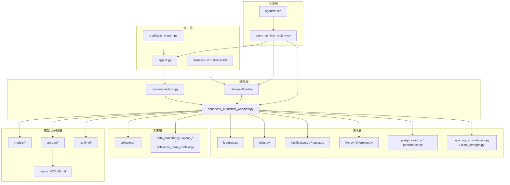
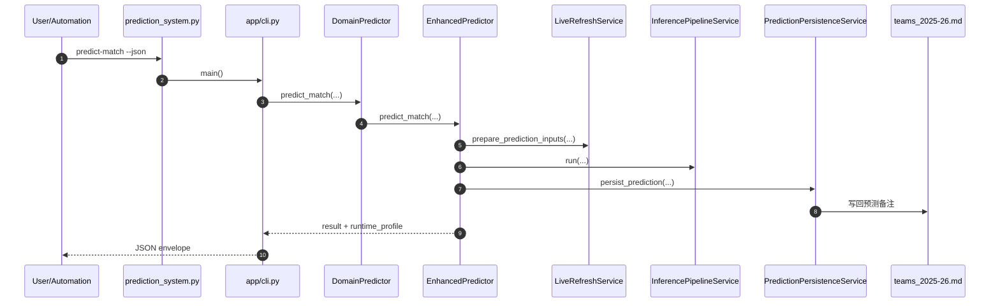
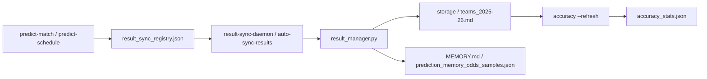
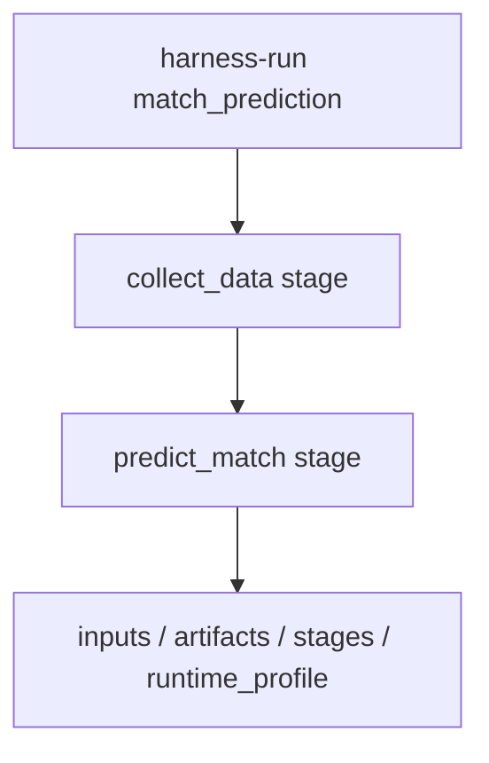
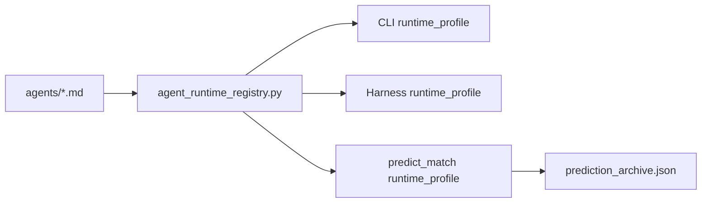

# Europe Leagues 项目架构与模块划分（技术分析）

本文目标：
- 用“整改后的真实代码结构”解释当前项目的分层、依赖与职责边界
- 说明哪些模块已经拆分完成，哪些地方仍保留兼容壳或存量脚本

范围：
- 代码：`/Users/bytedance/trae_projects/europe_leagues`
- 治理与 persona：`/Users/bytedance/trae_projects/agents/*.md`、`agent_runtime_registry.py`

---

## 1. 仓库总览

当前仓库已不再只是“脚本集合”，而是形成了 6 类稳定模块：
- **接口层**：CLI 入口、JSON envelope、自动化命令
- **编排层**：Harness pipeline/stage/context
- **领域层**：预测主流程编排与拆分后的领域服务
- **采集层**：赛程、快照、上下文与别名归一化
- **模型与存储层**：模型、SoT 写回、归档、统计、运行时路径
- **治理层**：persona、六维定义、runtime_profile 注入

### 1.1 关键入口

- CLI 兼容入口：`europe_leagues/prediction_system.py`
- CLI 实际实现：`europe_leagues/app/cli.py`
- 领域外壳：`europe_leagues/domain/predictor.py`
- 预测编排核心：`europe_leagues/enhanced_prediction_workflow.py`
- Harness 编排：`europe_leagues/harness/*`
- persona/runtime registry：`agent_runtime_registry.py`

### 1.2 单一事实来源

项目当前对“事实/写回”的约束保持不变：
- **赛程/赛果/预测备注**以 `europe_leagues/<league>/teams_2025-26.md` 为单一事实来源（SoT）
- **运行时统计/归档**写入 `europe_leagues/.okooo-scraper/runtime/`
- **赔率快照/赛程抓取**写入 `europe_leagues/.okooo-scraper/snapshots/` 和 `schedules/`

---

## 2. 分层架构

建议继续用“外到内”六层理解当前代码：
- L0 接口层：CLI / Harness
- L1 编排层：orchestration / pipeline / stage
- L2 领域层：特征、赔率、推理、后处理、持久化
- L3 采集层：赛程、快照、球队上下文、别名归一化
- L4 模型与存储层：Poisson / Dixon-Coles / Fusion / SoT / 归档 / 准确率
- L5 治理层：persona / 六维 / runtime_profile



---

## 3. 核心模块划分

### 3.1 接口层

| 模块 | 文件 | 当前职责 |
|---|---|---|
| CLI 兼容入口 | `prediction_system.py` | 对外保持旧命令路径不变，内部仅转发到 `app/cli.py` |
| CLI 主实现 | `app/cli.py` | 子命令路由、JSON envelope、`runtime_profile` 注入、命令级编排 |
| Harness Core | `harness/core.py` | `HarnessContext` / `PipelineStage` / `HarnessPipeline` / 审计输出 |
| Football Harness | `harness/football.py` | 注册 `match_prediction`、`result_recording` 等 pipeline |

要点：
- `prediction_system.py` 现在是兼容壳，不再承担真实命令实现
- 自动化调用应继续使用 `python3 prediction_system.py ... --json`
- 新功能优先落在 `app/cli.py`，避免再次把兼容层做厚

### 3.2 编排与领域层

| 模块 | 文件 | 当前职责 |
|---|---|---|
| 领域外壳 | `domain/predictor.py` | 对接口层暴露 `DomainPredictor`，屏蔽内部实现细节 |
| 预测编排核心 | `enhanced_prediction_workflow.py` | 保留主流程 orchestration，协调 live refresh、推理、后处理、持久化 |
| 特征服务 | `domain/features.py` | EWMA、联赛大小球学习、analysis_context 增强 |
| 赔率服务 | `domain/odds.py` | 盘口解析、历史赔率参考、大小球线解析与补抓 |
| 情报与爆冷 | `domain/intelligence.py`、`domain/upset.py` | 比赛画像、市场共振、爆冷风险识别 |
| 临场与推理 | `domain/live.py`、`domain/inference.py` | 快照刷新、输入准备、核心推理链、临场修正 |
| 后处理与持久化 | `domain/postprocess.py`、`domain/persistence.py` | 概率归一、凯利、结果对象装配、缓存/归档/MEMORY 写回 |
| 报告/写回/球队实力 | `domain/reporting.py`、`domain/writeback.py`、`domain/team_strength.py` | 报告格式化、`teams_2025-26.md` 写回、球队强度分析 |

要点：
- `EnhancedPredictor` 仍然存在，但已从“超大业务全集”收缩为 orchestrator
- 当前最重要的结构变化不是删除旧类，而是把高耦合逻辑迁到可复用服务模块
- `TeamDataManager` 等旧名称保留兼容别名，用于降低外部调用回归风险

### 3.3 采集层

| 模块 | 文件 | 当前职责 |
|---|---|---|
| 采集包 | `collectors/okooo.py`、`sporttery.py`、`sofascore.py`、`aliasing.py`、`odds_snapshots.py` | 新的采集/归一化/快照读取边界 |
| 存量脚本 | `data_collector.py`、`okooo_*`、`sofascore_team_context.py` | 仍作为历史入口与调试脚本保留 |
| 联赛数据 | `<league>/analysis/*`、`players/*.json` | 赛程快照、赔率落盘、球员与上下文数据 |

要点：
- `collectors/` 是整改后的正式抽象层
- `okooo_*` 和 `data_collector.py` 仍在使用，但更适合作为脚本入口或兼容实现
- `OddsSnapshotRepository` 已集中处理 CSV/JSON 快照读取与 `current_odds` 转换

### 3.4 模型与存储层

| 模块 | 文件 | 当前职责 |
|---|---|---|
| 模型 | `models/poisson.py`、`models/dixon_coles.py`、`models/fusion.py` | 核心概率模型与模型融合 |
| 存储 | `storage/teams_md.py`、`archive.py`、`accuracy.py` | SoT 读写、归档、准确率统计的稳定边界 |
| 运行时 | `runtime/cache.py`、`runtime/paths.py` | 缓存与 `.okooo-scraper` 路径管理 |
| 赛果管理 | `result_manager.py` | 历史兼容的赛果回填与 archive 迁移管理器 |

---

## 4. 端到端流程图

### 4.1 单场预测



### 4.2 赛后回填



### 4.3 Harness 编排



---

## 5. 本轮整改结果

本轮已经完成的核心整改包括：
- CLI 路由迁入 `app/cli.py`，`prediction_system.py` 降为兼容壳
- `EnhancedPredictor` 的 features、odds、writeback、upset、intelligence、snapshot、reporting、postprocess、persistence、live、inference、team_strength 已下沉到 `domain/` 或 `collectors/`
- `collectors/`、`models/`、`storage/`、`runtime/` 四类目录已落地
- `runtime_profile` 已贯穿 CLI、Harness、预测结果对象和 `prediction_archive.json`
- `runtime/result_sync.py` 已提供“预测后按开球时间推算完赛后 2 小时自动同步赛果”的运行时调度能力
- `runtime/memory_samples.py` 已把滚动记忆、赔率变化与已完赛结果同步成结构化样本，供历史赔率参考复用
- 项目主范围内的 Python 模块已统一补充文件头 `模块说明`，方便后续定位职责边界
- 保留旧入口与兼容类型，避免外部自动化调用中断

仍然保留的现实约束：
- `enhanced_prediction_workflow.py` 仍是关键 orchestration 文件，还不是“极薄外壳”
- `data_collector.py`、`okooo_*`、`result_manager.py` 等历史脚本仍在被主流程或周边脚本依赖
- 仍需逐步把更多脚本入口收敛到 `collectors/`、`storage/` 与 `app/cli.py`

---

## 6. 整改后目录（现状）

```text
europe_leagues/
  app/
    cli.py
  harness/
    core.py
    football.py
  domain/
    predictor.py
    features.py
    odds.py
    upset.py
    intelligence.py
    live.py
    inference.py
    postprocess.py
    persistence.py
    reporting.py
    writeback.py
    team_strength.py
  collectors/
    aliasing.py
    odds_snapshots.py
    okooo.py
    sofascore.py
    sporttery.py
  models/
    poisson.py
    dixon_coles.py
    fusion.py
  storage/
    teams_md.py
    archive.py
    accuracy.py
  runtime/
    cache.py
    paths.py
  enhanced_prediction_workflow.py
  prediction_system.py
  result_manager.py
  data_collector.py
  okooo_*.py
  <league>/teams_2025-26.md
```

兼容策略：
- `prediction_system.py` 保留旧调用路径
- `optimized_prediction_workflow.py` 保留旧结果结构兼容
- `TeamDataManager` 等旧命名通过兼容别名继续可用

---

## 7. 与 persona/六维的运行时承接

当前仓库已把 persona 六维真正接入运行时输出：
- 文档来源：`agents/*.md`
- registry：`agent_runtime_registry.py`
- CLI 注入：`app/cli.py build_json_result()`
- Harness 注入：`harness/core.py HarnessPipeline.execute()`
- 预测结果注入：`EnhancedPredictor.predict_match()`
- 归档注入：`result_manager.py` / `prediction_archive.json`



---

## 8. 快速定位

| 你想改什么 | 优先改哪里 | 备注 |
|---|---|---|
| 新增命令/对外入口 | `app/cli.py` | `prediction_system.py` 仅保留兼容 |
| 新增编排任务 | `harness/football.py` | 先定义 stage，再接 handler |
| 调整预测主链 | `enhanced_prediction_workflow.py`、`domain/*` | 优先改对应 service，而不是把逻辑再塞回主文件 |
| 调整采集来源 | `collectors/*`、必要时 `okooo_*` | 旧脚本仍可能是实际抓取入口 |
| 调整写回/归档 | `domain/writeback.py`、`domain/persistence.py`、`storage/*` | 注意 SoT 与 archive 一致性 |
| 调整 persona/runtime | `agents/*.md`、`agent_runtime_registry.py` | 输出会影响 CLI / Harness / archive |

---

## 9. 本次验证结论

2026-05-07 本轮完成后，已验证以下链路可运行：
- `python3 prediction_system.py list-leagues --json`
- `python3 prediction_system.py harness-list --json`
- `python3 prediction_system.py health-check --json`
- `python3 prediction_system.py predict-match --json`
- `python3 prediction_system.py auto-sync-results --json`
- `python3 prediction_system.py accuracy --refresh --json`

本轮额外修复：
- `predict-match --no-refresh-odds` 现在会同时跳过大小球补抓，避免在“禁用刷新”场景下仍然等待澳客抓取超时
- `poisson_analysis.py` 已从非法 Markdown 文本整理为可编译的说明脚本，整仓 Python 语法检查可通过
