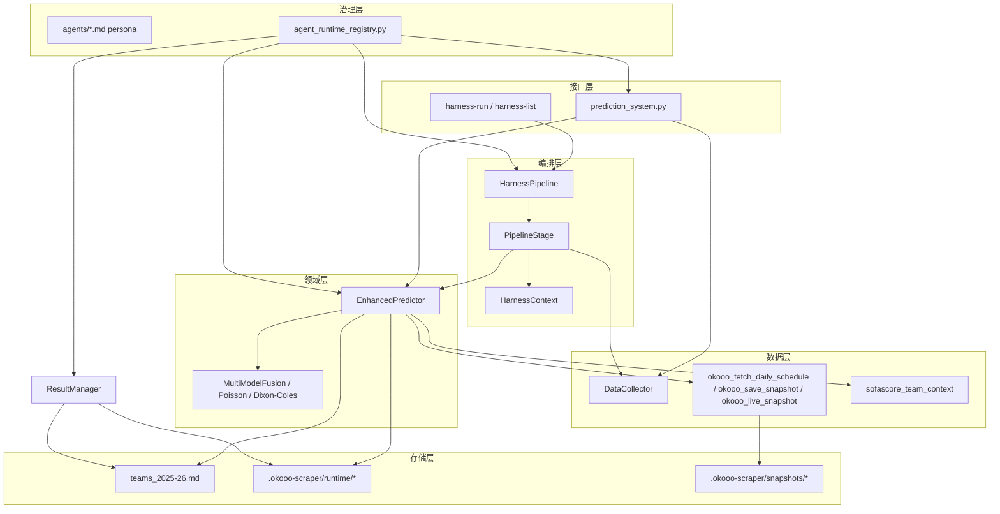
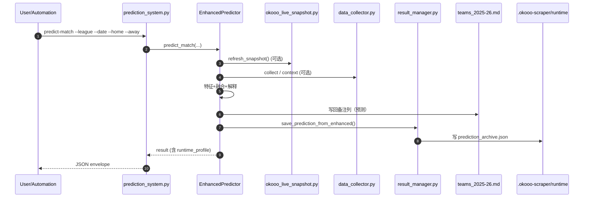
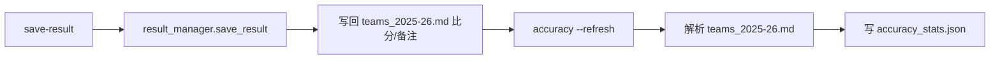
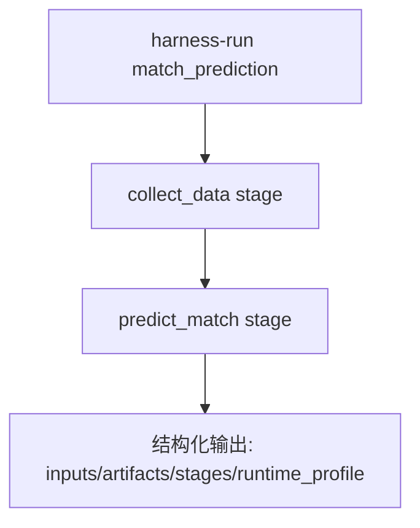
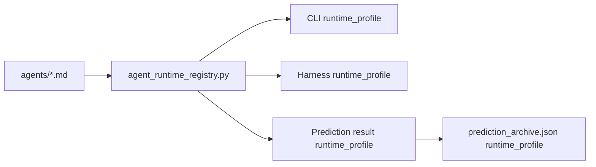

# Europe Leagues 项目架构与模块划分（技术分析）

本文目标：
- 把当前仓库从“脚本集合”抽象成清晰的分层架构，解释每层输入/输出与依赖关系
- 给出可落地的模块拆分建议（不重写业务，先治理连接层与边界）

范围：
- 代码：`/Users/bytedance/trae_projects/europe_leagues`
- 上位身份/提示词：`/Users/bytedance/trae_projects/agents/*.md` + `agent_runtime_registry.py`

---

## 1. 仓库总览（What’s in the repo）

从目录结构看，项目主要由 3 类内容组成：
- **产品化入口**：统一 CLI + Harness 编排
- **领域能力**：采集、预测、模型、写回、赛后统计
- **数据与产物**：联赛赛程/球员库、赔率快照、运行时统计与归档

### 1.1 关键入口

- CLI 统一入口：`europe_leagues/prediction_system.py`
- Harness 编排层：`europe_leagues/harness/*`
- 核心预测器（主业务）：`europe_leagues/enhanced_prediction_workflow.py`
- 数据采集：`europe_leagues/data_collector.py` + `europe_leagues/okooo_*`
- 赛果与统计：`europe_leagues/result_manager.py`

### 1.2 单一事实来源（SoT）

项目当前对“事实/写回”的约束很明确：
- **赛程/赛果/预测备注**以 `europe_leagues/<league>/teams_2025-26.md` 为单一事实来源（SoT）
- **运行时产物**写入 `europe_leagues/.okooo-scraper/runtime/`（统计、日志、归档等）

---

## 2. 分层架构（Layered Architecture）

建议用“外到内”六层来理解/划分模块：
- L0 接口层：CLI / Harness（对外调用方式）
- L1 编排层：Pipeline/Stage（任务拆解、审计、可重放）
- L2 领域层：预测流程（特征、规则、融合、解释）
- L3 数据层：采集/快照/上下文（赛程、赔率、阵容等）
- L4 存储层：写回与归档（teams_2025-26.md / runtime json）
- L5 治理层：persona/六维/可审计元数据（跨模块统一口径）



---

## 3. 核心模块划分（按职责）

### 3.1 接口层（CLI / Harness）

| 模块 | 文件 | 职责 | 关键输出 |
|---|---|---|---|
| CLI | `prediction_system.py` | 统一子命令入口；屏蔽 stdout 噪音；输出 JSON 便于自动化 | `build_json_result()` 结构化输出 |
| Harness | `harness/core.py` | Context/Stage/Pipeline；审计执行；结构化输出 | `stages[]` + `artifacts` |
| Football Pipeline | `harness/football.py` | 把“采集/预测/写回/赛后统计”注册为 pipeline | `match_prediction` / `result_recording` |

要点：
- Harness 解决“连接层”治理问题：输入/阶段/产物/错误审计标准化
- CLI 解决“调用层”治理问题：统一命令、统一 JSON envelope、适配自动化（openclaw）

### 3.2 领域层（预测核心）

| 模块 | 文件 | 职责 |
|---|---|---|
| 预测主流程（大文件） | `enhanced_prediction_workflow.py` | 预测端到端：读取上下文、刷新快照、特征计算、模型融合、生成解释、写回 SoT、归档与记忆 |
| 旧流程兼容 | `optimized_prediction_workflow.py` | 复用增强预测结果，保持旧入口/旧结构的兼容 |
| 模型集合 | `ml_prediction_models.py` | 泊松/迪克森科尔斯/融合等 |

现实问题（为什么“代码过于庞大”）：
- `enhanced_prediction_workflow.py` 同时承担 L2 领域逻辑 + L3 数据适配 + L4 写回归档，导致“单文件超大、耦合度高、改动风险大”

### 3.3 数据层（采集 / 快照 / 上下文）

| 模块 | 文件 | 数据来源 | 输出 |
|---|---|---|---|
| 赛程采集 | `data_collector.py` | sporttery / schedules cache / 其他 | `MatchData[]` |
| okooo 赛程与快照 | `okooo_fetch_daily_schedule.py` / `okooo_save_snapshot.py` / `okooo_live_snapshot.py` | okooo 移动端页面（含赔率 tab） | `.okooo-scraper/schedules/*` + `.okooo-scraper/snapshots/*` |
| 阵容/状态上下文 | `sofascore_team_context.py` | sofascore | `analysis_context.team_context` |
| 映射与归一化 | `okooo_team_aliases.json` | 人工维护 | 名称归一化、跨源对齐 |

### 3.4 存储层（写回 / 归档 / 统计）

| 模块 | 文件/目录 | 职责 |
|---|---|---|
| 写回 SoT | `<league>/teams_2025-26.md` | 赛程表备注列写回预测；比分列写回真实赛果 |
| 预测归档 | `.okooo-scraper/runtime/prediction_archive.json` | 按 match_id 归档预测结果（供赛后回填/复盘） |
| 准确率统计 | `.okooo-scraper/runtime/accuracy_stats.json` | 从 SoT 解析计算胜负/比分/大小球等 |
| 日志 | `.okooo-scraper/runtime/*.log` | 运行诊断 |

---

## 4. 端到端流程图（How it runs）

### 4.1 单场预测（predict-match）



### 4.2 赛后回填（save-result + accuracy）



### 4.3 Harness 编排（match_prediction pipeline）



---

## 5. 为什么会“庞大”（结构性原因）

核心原因不是“功能多”，而是“边界不清晰导致功能堆叠在少数文件里”：
- `enhanced_prediction_workflow.py` 既做预测（L2），又做数据适配（L3），又做写回/归档（L4），属于典型“超大聚合根”
- 大量脚本复用同一份 SoT（teams md）是正确的，但写回/解析逻辑散落在多个文件中，导致变更需要跨多处验证
- 采集/快照/上下文输入是异构来源（okooo、sporttery、sofascore），但归一化/命名对齐逻辑存在多处实现（维护成本高）

---

## 6. 模块拆分建议（可落地，不重写）

目标：不推翻现有代码，而是把“自然边界”提取成可维护模块，逐步把大文件切薄。

### 6.1 建议的目标目录（建议）

```text
europe_leagues/
  app/
    cli.py                 # 替代/承载 prediction_system.py 的命令路由
  harness/
    core.py
    football.py
  domain/
    predictor.py           # EnhancedPredictor 外壳（只保留 orchestration）
    features.py            # 特征工程/状态回溯（EWMA 等）
    odds.py                # 赔率结构、归一化、盘口信号
    writeback.py           # teams_2025-26.md 写回
  collectors/
    sporttery.py
    okooo.py               # schedule/snapshot driver
    sofascore.py
    aliasing.py            # team alias map
  models/
    poisson.py
    dixon_coles.py
    fusion.py
  storage/
    teams_md.py            # SoT 读写
    archive.py             # prediction_archive.json
    accuracy.py            # accuracy_stats.json
  runtime/
    paths.py               # .okooo-scraper 统一路径管理
```

拆分原则：
- **先抽 IO/存储（L4）**：写回/归档/统计抽出来最稳，回归风险最小
- **再抽数据适配（L3）**：okooo/sporttery/sofascore 归一化抽出来
- **最后抽领域逻辑（L2）**：把特征、融合、解释拆成可单测的组件

### 6.2 用 Harness 做“迁移护栏”

拆分过程中，用 Harness 保证“对外行为不变”：
- pipeline/stage 输出保持稳定
- 每次拆分只替换一个 stage 的 handler（或内部调用），便于回滚与审计

---

## 7. 与 persona/六维的运行时承接（治理层）

当前仓库已把 persona 六维落到运行时输出，形成审计链：
- persona/agent 文档来源：`/agents/*.md`
- 运行时 registry：`agent_runtime_registry.py`
- 输出承接点：
  - CLI JSON envelope：`prediction_system.py build_json_result()`
  - Harness output：`harness/core.py HarnessPipeline.execute()`
  - 预测结果对象：`EnhancedPredictor.predict_match()` 返回中包含 `runtime_profile`
  - 归档：`ResultManager.save_prediction_from_enhanced()` 写入 `prediction_archive.json`



---

## 8. 快速定位：从“需求”到“改哪里”

| 你想改什么 | 优先改哪里 | 备注 |
|---|---|---|
| 新增命令/对外入口 | `prediction_system.py` / 后续 `app/cli.py` | 先走 JSON envelope |
| 新增编排任务 | `harness/football.py` | 先分 stage，再接 handler |
| 调整预测逻辑 | `enhanced_prediction_workflow.py`（建议逐步拆到 `domain/`） | 注意写回/归档的副作用 |
| 调整采集来源 | `data_collector.py` / `okooo_*` / `sofascore_team_context.py` | 注意 alias 对齐 |
| 调整写回格式 | `enhanced_prediction_workflow.py` / `result_manager.py` | 建议抽到 `storage/teams_md.py` |

