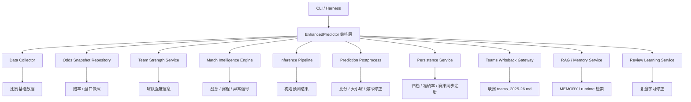
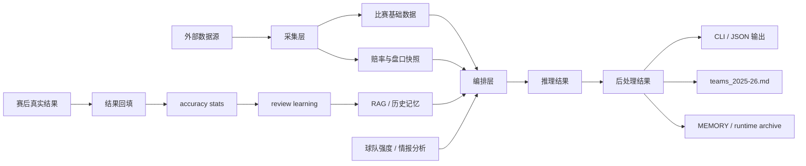
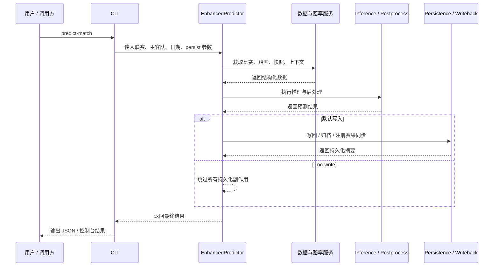
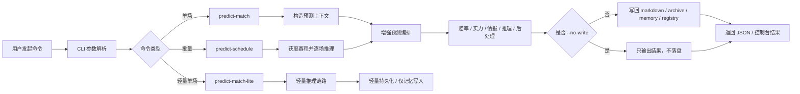
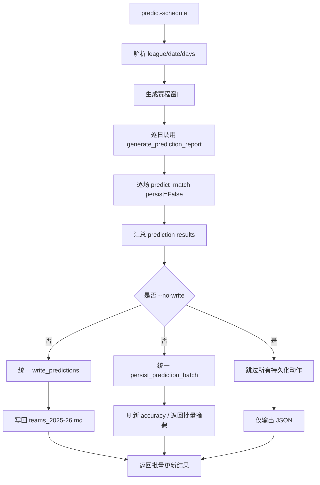
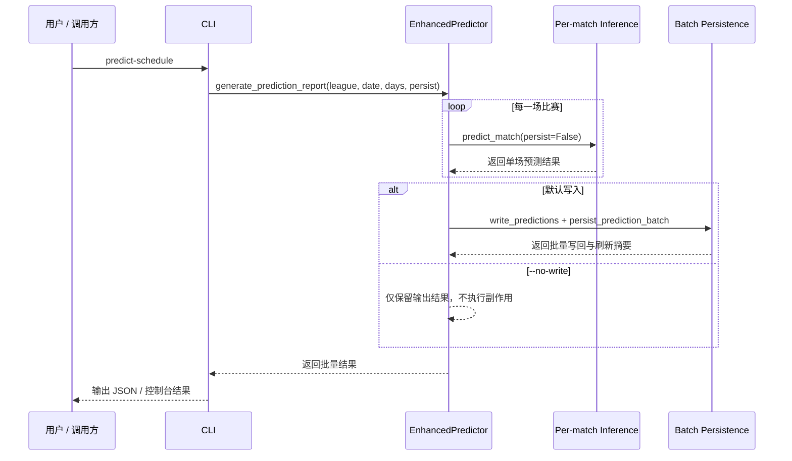
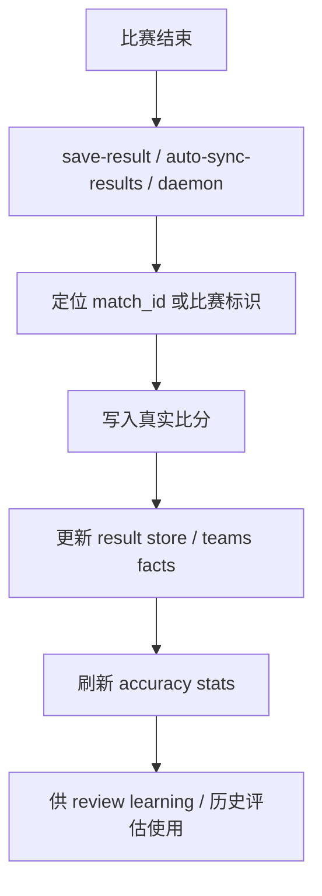
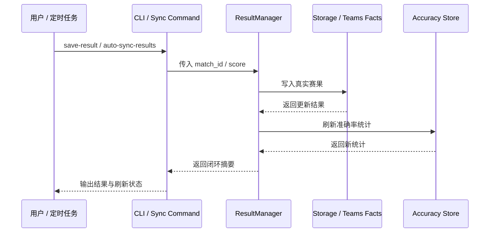

# 欧洲五大联赛预测系统完整流程指南（增强版）

> 面向项目维护、版本演进、流程交接与飞书沉淀的正式说明文档。

---

## 1. 文档摘要

这套系统已经不是一个单点预测脚本，而是一套完整的足球预测工作流，覆盖了：

- 赛程与赔率数据采集
- 单场 / 批量预测推理
- 预测结果写回与归档
- 赛果回填与准确率刷新
- RAG / 历史记忆增强
- 复盘学习与持续优化

从工程视角看，它本质上是一条“赛前预测 -> 写回事实源 -> 赛后闭环 -> 持续学习”的完整业务链路。

### 本文会回答 8 个核心问题

1. 这个系统到底在解决什么问题
2. 当前代码架构如何分层
3. 单场预测与批量预测的正式语义是什么
4. 预测结果会写到哪里
5. 赛后如何完成结果闭环
6. RAG / 记忆 / 归档在系统中的位置是什么
7. 当前主链相对历史版本优化了哪些关键点
8. 后续如果继续演进，应该优先优化什么

---

## 2. 系统定位与技术背景

这个项目不是简单的“给出一场比赛概率”，而是一个围绕足球预测构建的正式工作流系统。它同时承担四类职责：

### 2.1 数据采集

拉取和组织比赛所需的基础信息，包括：

- 赛程与对阵
- 赔率与盘口
- 快照与实时修正信息
- 比赛标识（如 `match_id`）

### 2.2 预测推理

结合多个维度完成预测：

- 球队强度
- 市场赔率信号
- 情报与战意
- 历史相似案例
- 回顾学习修正

最终输出：

- 胜平负方向
- 比分候选
- 大小球倾向
- 置信度与附加风险提示

### 2.3 持久化与写回

系统不会只“算完即结束”，而是会把结果写入长期或运行态事实源，例如：

- 五大联赛 `teams_2025-26.md`
- `MEMORY.md`
- runtime archive
- result sync registry

### 2.4 赛果闭环

比赛结束后，系统还会继续完成：

- 真实赛果回填
- 准确率更新
- 历史复盘沉淀
- 对后续预测的轻量修正

一句话概括：这是一套“预测编排 + 事实写回 + 赛果闭环 + 历史记忆增强”的综合系统。

---

## 3. 系统架构总览

### 3.1 架构分层

当前项目可以理解成 6 层：

1. **CLI / Harness 入口层**  
   对外暴露统一命令接口，把用户输入转成正式工作流调用。

2. **编排层**  
   负责串联采集、赔率、推理、后处理、持久化。当前核心在 `enhanced_prediction_workflow.py`。

3. **领域服务层**  
   提供单一职责能力，例如：
   - inference
   - postprocess
   - persistence
   - writeback
   - intelligence
   - upset
   - review learning

4. **数据访问层**  
   负责读写 markdown、runtime、snapshot、accuracy store、cache 等存储。

5. **事实源 / 运行态存储层**  
   包括：
   - 五大联赛 `teams_2025-26.md`
   - `MEMORY.md`
   - runtime archive
   - result sync registry
   - accuracy stats

6. **赛后闭环层**  
   负责 `save-result`、自动同步赛果、重算准确率、驱动复盘学习。

### 3.2 系统架构图

### 3.3 数据流图

### 3.4 单场预测时序图

---

## 4. 命令体系：formal workflow 与 legacy workflow

当前项目已经把命令面分成两类，正式使用时建议优先围绕 formal workflow 展开。

### 4.1 formal commands

这是当前正式主链：

- `collect-data`
- `predict-match`
- `predict-schedule`
- `predict-match-lite`
- `save-result`
- `auto-sync-results`
- `accuracy`
- `health-check`
- `harness-run`

这些命令具备更稳定的运行时语义、测试覆盖和文档约束，是当前推荐入口。

### 4.2 legacy commands

以下命令仍然保留兼容，但不再作为主链推荐入口：

- `enhanced`
- `original`
- `ml-test`
- `results`
- `show-accuracy`
- `update-accuracy`

### 4.3 为什么要区分 formal 与 legacy

这一步的意义在于把“还能跑的历史入口”和“当前正式工作流”区分开，避免：

- 用户误把 legacy 入口当成正式接口
- 测试覆盖和文档维护对象不一致
- 调用方对命令行为产生错误预期

因此当前建议是：

1. 日常使用只围绕 formal commands
2. legacy 只承担兼容职责
3. 所有新增功能优先落在 formal workflow 上

---

## 5. 完整预测主流程

### 5.1 总体流程图

### 5.2 总体流程说明

无论是单场还是批量预测，正式主链都遵循同一条原则：

1. 先构造完整上下文
2. 再做推理与后处理
3. 最后按是否允许写入来决定是否触发持久化副作用

这让系统具备了两个关键特性：

- 可以做正式落链预测
- 也可以做纯输出 smoke / 预览 / 回归验证

---

## 6. 单场预测流程：predict-match

### 6.1 适用场景

适合以下场景：

1. 已知具体一场比赛，想做完整预测
2. 想检查某场比赛的最新赔率、方向、比分、大小球
3. 想让结果进入正式持久化链路
4. 想在 `--no-write` 下只看结果，不产生副作用

### 6.2 单场预测执行步骤

#### 第一步：CLI 接收参数

典型参数包括：

- 联赛
- 主队
- 客队
- 日期
- 可选 `match_id`
- 是否刷新赔率
- 是否 `--no-write`
- 是否输出 JSON

CLI 层负责两件事：

1. 参数标准化
2. 调用真实预测器，而不是自己做业务计算

#### 第二步：编排层组装上下文

进入 `EnhancedPredictor` 后，会拉起整套依赖，包括：

- 实时/本地赔率引用
- snapshot repository
- RAG service
- persistence service
- live refresh service
- inference service
- postprocess service
- writeback gateway
- review learning service
- upset analyzer
- team strength service
- intelligence engine

这也是为什么编排层仍偏厚，因为它现在仍然掌握太多横向依赖。

#### 第三步：拉取比赛与赔率信息

系统会尽量确认：

1. 这场比赛是谁对谁
2. 所属联赛是什么
3. 比赛日期和时间
4. 是否能拿到 match_id
5. 当前赔率/盘口是否可用
6. 历史快照是否足够

#### 第四步：球队强度与比赛情报分析

这一层会融合：

- 球队整体强弱
- 主客场差异
- 赔率隐含倾向
- 赛程密度
- 战意风险
- 爆冷因子
- 历史案例
- 回顾学习修正

#### 第五步：推理层给出初始预测

推理层主要给出：

1. 胜平负概率
2. 候选比分分布
3. 大小球方向
4. 总进球分布
5. 置信度
6. 可选仓位建议

#### 第六步：后处理层修正结果

后处理不是“再算一遍模型”，而是做工程化落地修正。当前比较关键的工作包括：

1. 比分候选方向约束  
   如果主结论是“主胜”，就不应该再给明显反方向比分。

2. 双选场景允许双方向比分  
   如果主结论是双选，不强行压成单方向。

3. 低节奏/小球确认场景  
   会进一步压低高总进球模板。

4. 浅盘/市场确认不足场景  
   会抑制“看起来很顺但过大的比分模板”。

5. review-learning 修正  
   用历史复盘经验做轻量再校准，但不改坏主结论。

#### 第七步：生成最终展示结果

最终结果通常包含：

- 主队 / 客队
- 联赛名称
- 比赛日期
- 预测方向
- 置信度
- 概率分布
- `top_scores`
- `over_under`
- 爆冷信息
- 持久化元数据 `persisted`

#### 第八步：决定是否持久化

这里是当前主链里最重要的一个语义点：

##### 默认情况

`predict-match` 默认会持久化。

可能触发的动作包括：

1. 归档预测结果
2. 更新 MEMORY / 轻量知识
3. 注册赛果同步信息
4. 五大联赛写回 `teams_2025-26.md`
5. 让后续 `save-result` / `auto-sync-results` 能顺利闭环

##### `--no-write`

表示纯输出，不产生持久化副作用。

也就是说：

- 不归档
- 不写 teams markdown
- 不更新 memory
- 不注册赛果同步
- 只返回预测结果

---

## 7. 批量预测流程：predict-schedule

### 7.1 为什么批量预测要单独定义语义

批量预测和单场预测表面相似，但工程行为完全不同。

如果直接把批量流程做成“循环调用单场完整持久化”，会产生明显问题：

1. 每场都 archive，副作用过重
2. 每场都更新 memory，不符合批量语义
3. 每场都注册赛果同步，边界不清晰
4. 每场都写 markdown，容易形成重复写入
5. 准确率刷新会被重复触发，增加额外开销

因此当前正式主链把 `predict-schedule` 明确定义为：

> 批量推理 + 批量级副作用

而不是：

> 多次单场完整持久化

### 7.2 当前正式语义

#### 默认模式

- 逐场完成推理
- 循环内部不做逐场持久化
- 循环结束后统一 writeback
- 统一刷新 accuracy
- 返回每场结果与批量 persisted summary

#### `--no-write`

- 逐场只推理
- 不写 markdown
- 不 archive
- 不 memory
- 不 registry
- 不刷新 accuracy
- 只输出结果

### 7.3 批量流程图

### 7.4 批量预测时序图

---

## 8. 预测结果写入位置与事实源边界

### 8.1 五大联赛：长期事实源

以下联赛以各自目录下的 `teams_2025-26.md` 作为正式事实源：

- 英超
- 西甲
- 意甲
- 德甲
- 法甲

默认写回后，预测信息会进入对应比赛行的备注区，通常包括：

- 预测方向
- 信心
- 比分候选
- 大小球倾向
- 爆冷提示
- 案例提示
- 动态调权状态
- MatchID

### 8.2 欧战 / 杯赛：运行态优先

如：

- 欧冠
- 欧联
- 欧协联

这类比赛当前更偏向 runtime-only 语义，不强制写入五大联赛式 markdown 事实源，而是更多写入：

- `MEMORY.md`
- runtime archive
- 运行时记录

### 8.3 写回层的工程约束

当前 writeback 层已经做过多轮收敛，重点约束包括：

1. 主方向与比分方向不能明显冲突
2. 历史脏备注允许被规范化修复
3. `案例:` 等片段会自动清洗
4. 已完赛行不会被错误重写为新的预测行

这些约束的目标，是把“模型输出”稳定转换成“长期可维护的人类事实记录”。

---

## 9. 赛后闭环流程

### 9.1 闭环入口

当前正式闭环命令主要有：

- `save-result`
- `auto-sync-results`
- `result-sync-daemon`
- `sync-pending-results-review`
- `accuracy --refresh --json`（显式重建）

### 9.2 闭环目标

赛后闭环需要完成四件事：

1. 找到对应比赛
2. 写入真实比分和胜负结果
3. 更新准确率统计
4. 将结果沉淀给后续复盘学习使用

### 9.3 闭环流程图

### 9.4 赛果闭环时序图

### 9.5 save-result 的作用

`save-result` 是最明确、最可控的人工闭环入口。

输入通常包括：

- `match_id` 或比赛标识
- 主队进球
- 客队进球
- 可选 `league`
- 可选 `date_override`
- 可选 `force`

### 9.6 accuracy 的位置

`accuracy --refresh --json` 是正式准确率重建入口。它不仅用于展示，更承担：

- 重刷准确率
- 修正旧统计状态
- 输出标准 JSON 数据

---

## 10. RAG / 记忆 / 归档在系统中的位置

这个项目区别于普通脚本的关键之一，是它保留了“经验层”。

### 10.1 记忆层解决什么问题

RAG / memory 主要解决三类问题：

1. 历史案例检索
2. 解释增强
3. 持续学习

### 10.2 它不是主模型替代品

需要明确的边界是：

- 主结论仍主要来自 inference + market + intelligence
- RAG / memory 是增强层，不是替代层
- 它更适合做校正、解释、类比和轻量修正

---

## 11. runtime profile 的意义

CLI 输出中的 `runtime_profile` / `agent_roles` 不是装饰字段，它有两个实际价值：

1. 告诉调用方这条命令实际调动了哪些角色
2. 帮助 formal workflow 与 legacy workflow 做边界管理

这让命令从“只是能跑”变成“语义明确的工作流节点”。

---

## 12. 当前主链相对历史版本的核心改进

从工程角度看，这一轮主链相对历史版本的主要进步有 6 点：

1. 命令面更清晰
2. `--no-write` 契约统一
3. 批量预测不再逐场重持久化
4. writeback 更像“事实维护”而不是“字符串拼接”
5. top_scores 更贴合主方向
6. 赛果闭环更加完整

---

## 13. 使用者视角：推荐操作手册

### 13.1 看某场比赛怎么预测

推荐步骤：

1. 先确认 `match_id` 或比赛基本信息
2. 使用 `predict-match`
3. 如果只想预览，不落库，带 `--no-write`
4. 如果要进入正式记录，不带 `--no-write`

### 13.2 看某天整轮比赛

推荐步骤：

1. 使用 `predict-schedule`
2. 若要正式更新联赛预测，走默认模式
3. 若只做 smoke / 预览 / 回归测试，使用 `--no-write`

### 13.3 比赛结束后更新赛果

推荐优先级：

1. `auto-sync-results` / daemon 自动同步
2. 若失败，使用 `save-result`
3. 再通过 `accuracy --refresh --json` 验证统计结果

### 13.4 验证系统环境是否正常

在正式使用前，建议先执行：

- `health-check`

因为这条命令能帮助快速判断浏览器、采集链路、运行环境是否处于可用状态。

---

## 14. 设计层面仍可继续优化的方向

虽然当前主链已经明显比历史版本更稳定，但如果继续演进，最值得优先推进的是下面三块。

### 14.1 编排层仍偏厚

当前 `EnhancedPredictor` 仍然掌握了过多服务、流程和副作用入口。后续如果继续优化，最理想的方向是：

- 拆分单场预测编排
- 拆分批量预测编排
- 拆分赛后闭环编排

这样可以进一步降低维护成本和测试复杂度。

### 14.2 批量预测与赛后闭环的一致性还可以继续增强

未来可以继续补强：

1. 批量 writeback summary 更细
2. 批量异常收集更统一
3. 批量失败补偿更明确

### 14.3 比分优化仍有继续精修空间

当前已经完成第二轮轻量校准，但如果目标是继续拉高比分准确率，下一步更值得做的是：

1. 把低节奏 / 小球信号再细化
2. 引入更稳定的比分模板惩罚矩阵
3. 把赛后复盘中“错在哪类比分模板”结构化沉淀下来

---

## 15. 适合飞书文档的推荐目录

如果要把这份说明作为长期飞书云文档维护，推荐目录如下：

1. 项目目标与系统定位
2. 系统架构总览
3. 当前正式命令体系
4. 完整预测主流程
5. 单场预测流程
6. 批量预测流程
7. 结果写回与事实源边界
8. 赛后闭环与准确率刷新
9. RAG / 记忆 / 归档机制
10. 当前架构亮点
11. 后续优化方向
12. 常见操作手册
13. 架构图 / 时序图 / 数据流图附录

---

## 16. 总结版结论

当前这套系统已经不是单点预测脚本，而是一个具备正式命令入口、领域推理、批量编排、事实写回、赛果闭环和记忆增强能力的完整预测工作流系统。

最关键的现状可以总结为三点：

1. `predict-match` 和 `predict-schedule` 已经形成统一契约，`--no-write` 表示纯输出，默认模式表示正式落链。
2. 五大联赛以 `teams_2025-26.md` 作为长期事实源，欧战 / 杯赛更多走 runtime / memory 语义。
3. 系统真正的价值不只是“赛前算一次”，而是“赛前预测 + 赛后回填 + 准确率重算 + 历史经验修正”的完整闭环。
