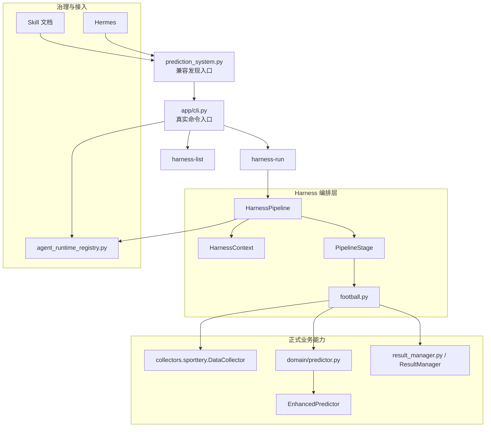

# Harness 当前结构与治理说明

## 目标

本文档不再把 Harness 视为“第一版改造草案”，而是直接说明当前仓库中的真实 Harness 结构、入口、职责边界，以及它与 CLI、Skill、Hermes 的关系。

当前 Harness 的定位只有一句话：

- Harness 是项目里的可审计编排层，不是新的业务主入口

它解决的问题主要是：

1. 把多步任务包装成稳定的 pipeline
2. 把输入、阶段产物、失败点结构化返回
3. 为 Agent、自动化调用和外部调度器提供可消费结果
4. 在不重写业务内核的前提下，把正式链路按阶段暴露出来

## 当前真实入口

### 入口分层

当前项目的真实入口关系如下：

- `prediction_system.py`：兼容入口，只负责发现与转发
- `app/cli.py`：真实 CLI 入口，负责命令注册、参数解析、JSON 输出与运行时角色注入
- `harness/*`：由 CLI 暴露出来的一类 pipeline 编排能力

因此，Harness 的当前真实入口不是单独的脚本，而是：

```text
prediction_system.py  ->  app/cli.py  ->  harness-run / harness-list
```

对 Hermes、Skill 或其他接入方都应保持同一条识别规则：

- 可以从 `prediction_system.py` 发现入口
- 但必须继续下钻到 `app/cli.py` 执行真实命令
- Harness 只是 `app/cli.py` 暴露出来的正式命令族之一

## 当前管理结构

### 目录结构

```text
europe_leagues/
├── prediction_system.py
├── app/
│   └── cli.py
└── harness/
    ├── __init__.py
    ├── core.py
    └── football.py
```

### 职责分层

- `prediction_system.py`
  - 兼容旧调用路径
  - 不承载真实业务编排

- `app/cli.py`
  - 提供 `harness-list`
  - 提供 `harness-run`
  - 负责把 CLI 输入组装为 Harness `inputs`
  - 负责把 pipeline 执行结果纳入统一 JSON envelope

- `harness/core.py`
  - 定义 `HarnessContext`
  - 定义 `PipelineStage`
  - 定义 `HarnessPipeline`
  - 负责阶段执行、失败捕获、审计记录、`runtime_profile` 注入

- `harness/football.py`
  - 注册足球领域 pipeline
  - 桥接领域能力到 Harness 阶段
  - 当前提供：
    - `match_prediction`
    - `result_recording`

## 当前 Harness 管理结构图



### 当前管理链路

可以把当前 Harness 理解成四层管理链：

1. 入口管理：`prediction_system.py` 发现入口，`app/cli.py` 真执行
2. Pipeline 管理：`harness/football.py` 负责注册和维护 pipeline
3. 执行审计：`harness/core.py` 负责记录 `inputs / artifacts / stages / error`
4. 接入治理：Skill 与 Hermes 通过 CLI 使用 Harness，而不是直接拼接底层模块

## 当前可用 Pipeline

### 1. `match_prediction`

用途：

- 用阶段化方式执行单场赛前预测
- 返回可审计的中间产物与最终预测结果

当前阶段：

1. `collect_data`
2. `predict_match`

底层桥接关系：

- `collect_data` -> `collectors.sporttery.DataCollector`
- `predict_match` -> `domain/predictor.py` -> `EnhancedPredictor`

### 2. `result_recording`

用途：

- 用阶段化方式执行赛果写回与准确率刷新

当前阶段：

1. `save_result`
2. `refresh_accuracy`

底层桥接关系：

- `save_result` -> `ResultManager.save_result()`
- `refresh_accuracy` -> `ResultManager.update_accuracy_stats()`

## 与 CLI 的关系

Harness 不是平行于 CLI 的另一套系统，而是 CLI 中的一组正式命令。

当前命令关系：

- 查看 pipeline：`prediction_system.py harness-list --json`
- 执行 pipeline：`prediction_system.py harness-run --pipeline ... --json`

真实执行路径：

```text
prediction_system.py
  -> app/cli.py
    -> build_pipeline(name)
      -> HarnessPipeline.execute(inputs)
```

这意味着：

- 参数解析与上下文文件读取属于 CLI
- Pipeline 注册与阶段执行属于 Harness
- JSON envelope 与外部消费格式属于 CLI

## 与 Skill 的关系

当前 Skill 不应把 Harness 写成“独立入口”，而应把它描述为正式 CLI 链路中的“可审计分支”。

正确关系是：

- 普通正式预测：`predict-match` / `predict-schedule`
- 需要阶段化与可审计结果时：`harness-run --pipeline match_prediction`
- 需要阶段化赛果回填时：`harness-run --pipeline result_recording`

因此，Skill 中关于 Harness 的正确表述应是：

- 通过 `prediction_system.py` 发现入口
- 在 `app/cli.py` 执行 `harness-run`
- 不绕开 CLI 直接调用 `harness/*.py`

## 与 Hermes 的关系

Hermes 不应直接把 Harness 当作单独框架接入，而应遵守仓库统一规则：

- 从 `prediction_system.py` 发现入口
- 下钻到 `app/cli.py`
- 在需要阶段化、可审计输出时，选择 `harness-run`

换句话说：

- Hermes 管理“何时调用哪条命令”
- Harness 管理“命令内部如何分阶段执行”
- Skill 管理“什么时候应选择 Harness 而不是普通命令”

这三层不是替代关系，而是分工关系。

## 当前状态判断

当前 Harness 核心代码不算过时，但它的文档口径此前已经落后于当前项目演进，主要体现在：

- 旧文档容易让人误以为 `prediction_system.py` 是真实主入口
- 旧文档没有把 Harness 与 `app/cli.py` 的关系讲清楚
- 旧文档没有把 Harness 与 Skill / Hermes 的分工讲清楚
- 旧文档更像“第一版引入说明”，而不是“当前管理说明”

因此，当前更需要更新的是文档和治理口径，而不是重写 Harness 核心。

## 当前可用命令

### 查看可用 Pipeline

```bash
cd /Users/bytedance/trae_projects/europe_leagues
python3 prediction_system.py harness-list --json
```

### 用 Harness 跑赛前单场预测

```bash
cd /Users/bytedance/trae_projects/europe_leagues
python3 prediction_system.py harness-run \
  --pipeline match_prediction \
  --league la_liga \
  --home-team 巴塞罗那 \
  --away-team 皇家马德里 \
  --date 2026-05-11 \
  --json
```

### 用 Harness 做赛果回填

```bash
cd /Users/bytedance/trae_projects/europe_leagues
python3 prediction_system.py harness-run \
  --pipeline result_recording \
  --match-id la_liga_20260511_巴塞罗那_皇家马德里 \
  --home-score 2 \
  --away-score 1 \
  --refresh \
  --json
```

## 后续演进清单

建议把后续演进按“文档对齐 -> 能力增强 -> 治理完善”三层推进。

### 第一层：文档与识别规则

1. 持续保持 `prediction_system.py -> app/cli.py -> harness-run` 的入口说明一致
2. 在 Skill 文档中继续明确 Harness 只是“可审计分支”
3. 在 Hermes 接入规范里明确：不要跳过 CLI 直接调用 Harness 模块

### 第二层：Pipeline 能力增强

1. 把 `predict-schedule` 收敛成独立 pipeline
2. 增加 `resolve_match_id` 阶段
3. 增加 `team_context` / `odds_snapshot` / `result_review` 阶段
4. 增加 `policy` 层，约束哪些 pipeline 可以写文件

### 第三层：治理与可观测性

1. 增加 `artifact persistence`，把每次执行落盘到 `.okooo-scraper/runtime/harness_runs/`
2. 增加 `stage metrics`，记录耗时、失败率、降级原因
3. 增加 pipeline 级别的成功率和失败原因统计
4. 把 Harness 输出纳入统一复盘与审计视图

## 结论

当前 Harness 的真实定位已经很清楚：

- 它不是替代 CLI 的主入口
- 它不是替代 Skill 的选择层
- 它也不是 Hermes 的 Hook 层
- 它是当前项目里“面向 Agent 与自动化调用的可审计编排层”

从工程视角看，现在对 Harness 最值得做的事不是重写，而是：

1. 把入口与关系文档写准
2. 把 pipeline 逐步扩展到更多正式链路
3. 把运行结果做成更强的可观测、可落盘、可统计体系
